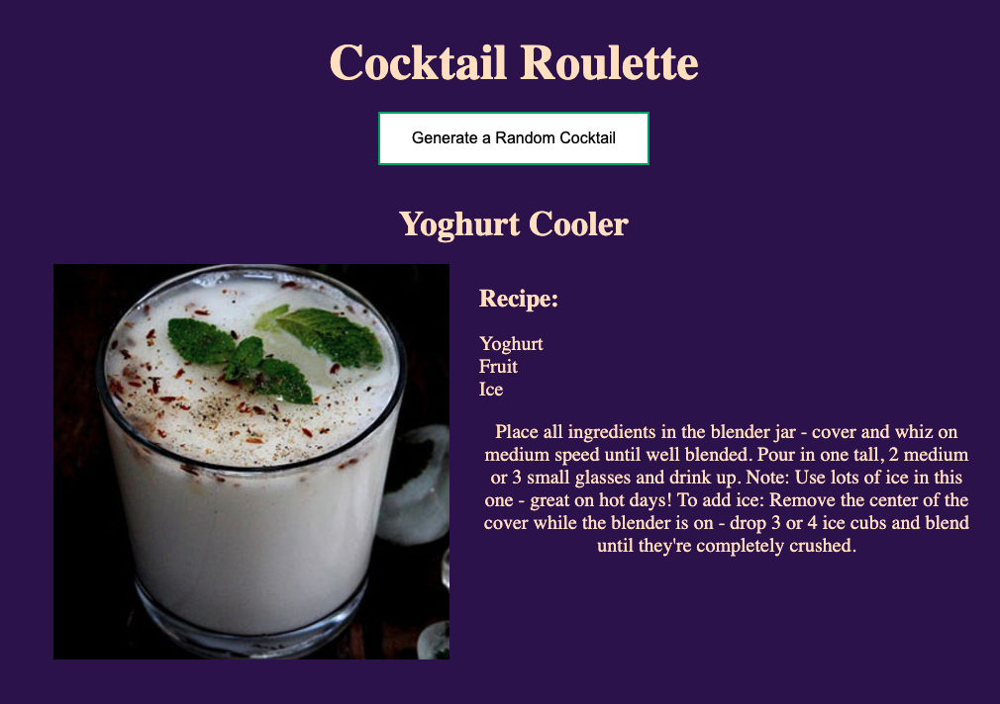

# Cocktail Roulette

## Table of contents
- [Overview](#overview)
  - [The challenge](#the-challenge)
  - [Screenshot](#screenshot)
  - [Links](#links)
- [My process](#my-process)
  - [Built with](#built-with)
  - [What I learned](#what-i-learned)
- [Installation & Setup](#installation--setup)
- [Author](#author)

## Overview

### The challenge
Users should be able to:
- Generate a random cocktail.
- View a cocktail’s image, name, ingredients, and instructions.
- Refresh the page to generate a new random cocktail.

### Screenshot

## My process

### Built with
- **Backend:** Node.js with Express
- **Frontend:** HTML, CSS, EJS (templating engine)
- **API:** TheCocktailDB API

### What I learned
During this project, I improved my skills in:
- **Backend Development:** Working with Express.js to set up a simple server.
- **Frontend Development:** Using EJS to render dynamic data on the webpage.
- **API Integration:** Fetching data from TheCocktailDB API and displaying it in the UI.

## Installation & Setup
1. Clone the repository:
   - git clone <https://github.com/SebastianJast/Cocktail-roulette.git>
2. Navigate into the project directory:
   - cd project-directory
3. Install dependencies and start the app:
   - npm install
   - node index.js
4. Open the app in your browser: Navigate to http://localhost:3000.

## Author
- GitHub - [@SebastianJast](https://github.com/SebastianJast)
- Website - [Sebastian](https://sebastianjast.github.io/Responsive_CV/)